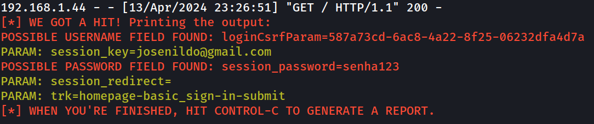

> Vitor Araujo - DIO


# Phishing para captura de credenciais do Facebook


## Ferramentas Utilizadas

- Kali Linux (OS)
- setoolkit


## Configurando o Phishing no Kali Linux

1. Deve-se estar logado como root.
	- comando: ``` sudo su ```

2. Iniciar a ferramenta setoolkit.
	- comando: ``` setoolkit ```

3. Concordar com os termos de servico da ferramenta (caso seja a primeira vez utilizando a ferramenta).
	- comando: ``` y ```

4. Tipo de ataque: Social-Engineering Attacks.
	- comando: ``` 1 ```

5. Vetor de ataque: Web Site Attack Vectors.
	- comando: ``` 2 ```

6. Método de ataque: Credential Harvester Attack Method.
	- comando: ``` 3 ```

7. Mecanismo de ataque: Site Cloner
	- comando: ``` 2 ```

8. Precisamos inserir o IP da nossa maquina. Geralmente o setoolkit detecta de forma automatica. Caso contrario, abra um novo teminal para identificar seu IP.
	- comando: ``` ip a s ```

9. URL para clone: http://www.facebook.com


## POC (Resultado)


